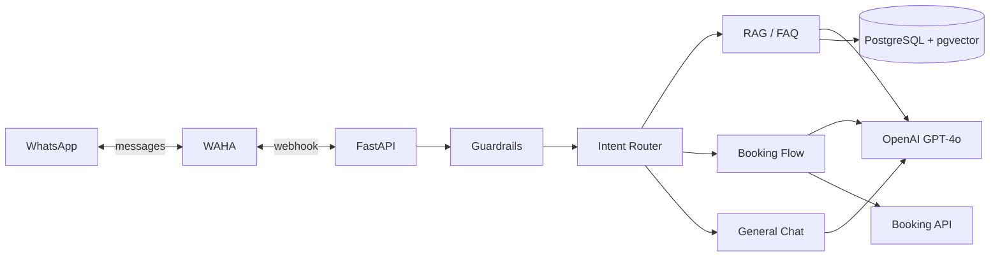

# WhatsApp AI Chatbot

LangChain + LangGraph agentic chatbot with RAG knowledge retrieval and multi-turn booking — delivered over WhatsApp.

## Architecture



## Key Features

- **4-layer guardrail pipeline** — content moderation, prompt injection detection, PII filtering, topic guard
- **Intent-based routing** — FAQ, booking, product inquiry, general conversation
- **RAG with pgvector** — PDF/TXT ingestion, cosine similarity search
- **Multi-turn booking flow** — 8-step stateful conversation via LangGraph
- **Conversation history** — persisted in PostgreSQL across sessions
- **Structured logging** — JSON logs via structlog

## Tech Stack

| Component | Technology |
|-----------|------------|
| Agent framework | LangChain + LangGraph |
| API server | FastAPI |
| Database | PostgreSQL + pgvector |
| LLM | OpenAI (GPT-4o / GPT-4o-mini) |
| WhatsApp gateway | WAHA |
| Infrastructure | Docker Compose |
| Package manager | uv |

## Quick Start

```bash
cp .env.example .env   # add your OPENAI_API_KEY
make up                 # start all services
make migrate            # run database migrations
make seed               # ingest knowledge docs (optional)
make health             # verify the app is running
```

## Available Commands

| Command | Description |
|---------|-------------|
| `make help` | Show all available targets |
| `make build` | Build Docker images |
| `make up` | Start all services (detached) |
| `make down` | Stop all services |
| `make restart` | Restart all services |
| `make logs` | Tail logs for all services |
| `make logs-app` | Tail logs for app only |
| `make migrate` | Run Alembic migrations |
| `make seed` | Seed knowledge base from `data/knowledge/` |
| `make test` | Run pytest |
| `make lint` | Run ruff linter |
| `make shell` | Open a shell in the app container |
| `make db-shell` | Open psql shell |
| `make health` | Check app health endpoint |
| `make clean` | Stop services, remove volumes and images |

## Project Structure

```
src/app/
├── agent/          # LangGraph graph, nodes, prompts, state
├── api/            # FastAPI routes (health, webhook)
├── core/           # Config, database, logging
├── guardrails/     # Content moderator, injection, PII, topic filter
├── models/         # SQLAlchemy models
├── rag/            # Embeddings, ingestion, retriever
├── schemas/        # Pydantic schemas (booking, WAHA)
├── services/       # Chat orchestration, WAHA client, booking API
├── tools/          # LangChain tools (RAG, booking, catalog)
└── main.py         # FastAPI app factory
```

## Environment Variables

| Variable | Description |
|----------|-------------|
| `OPENAI_API_KEY` | OpenAI API key **(required)** |
| `DATABASE_URL` | PostgreSQL connection string |
| `WAHA_API_URL` | WAHA instance URL |
| `WAHA_API_KEY` | WAHA API key |
| `WAHA_SESSION` | WAHA session name |
| `BOOKING_API_URL` | External booking API URL |
| `BOOKING_API_KEY` | Booking API key |
| `LOG_LEVEL` | Logging level (default: `INFO`) |
| `ENVIRONMENT` | Runtime environment (default: `development`) |

## API Endpoints

| Method | Path | Description |
|--------|------|-------------|
| `GET` | `/health` | Health check — returns service status |
| `POST` | `/webhook/waha` | WAHA webhook — receives incoming WhatsApp messages |
